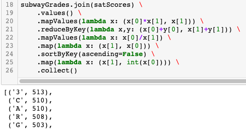

## Big Data

  

Screenshot from Pyspark script analyzing SAT Math performance in NYC based on access to different subway lines. The snapshot shows the RDD transformations used to find the top 5 subway lines in NYC with the highest mean SAT Math scores.

### Overview

This repo contains exercises and projects I completed for Big Data Management at NYU in the Spring of 2019. We used MapReduce and PySpark to stream massive datasets and find patterns in the infamous Enron email data set, NYC taxi data, and Twitter.

Also check out my repos [nyuProjects](https://github.com/seeess1/nyuProjects "nyuProjects") and [machineLearning](https://github.com/seeess1/machineLearning "machineLearning") for examples of other work with scikit-learn, pandas, and SQL.